<!-- START doctoc generated TOC please keep comment here to allow auto update -->
<!-- DON'T EDIT THIS SECTION, INSTEAD RE-RUN doctoc TO UPDATE -->

- [Nim ImPlot binding](#nim-implot-binding)
- [Direct install from Web](#direct-install-from-web)
- [Runing test application](#runing-test-application)
- [Compiling application](#compiling-application)
- [Generating ImPlot binding for development](#generating-implot-binding-for-development)
- [Development](#development)
- [Tools info](#tools-info)
- [Example gallery written in Nim language](#example-gallery-written-in-nim-language)
  - [Plots](#plots)
  - [Subplots](#subplots)
  - [Axes](#axes)

<!-- END doctoc generated TOC please keep comment here to allow auto update -->


### Nim ImPlot binding

---

Note: This project is highly under constructions at this moment.

1. This project uses the modified generator that derived from the achievement of [Nimgl/imgui](https://github.com/nimgl/imgui) and [nimgl-imgui](https://github.com/daniel-j/nimgl-imgui)(forked).
1. This project also uses [nim-imgui (ImGui v1.89.9)](https://github.com/dinau/nimgl-imgui) derived from [Nimgl/imgui](https://github.com/nimgl/imgui) and [nimgl-imgui](https://github.com/daniel-j/nimgl-imgui)(forked).

### Direct install from Web

---

```sh
nimble install https://github.com/dinau/nim_implot
```

### Runing test application

---

```bash
git clone --recursive https://github.com/dinau/nim_implot
cd nim_implot
nimble test
```

Test source: [examples/ImPlotDemo.nim](examples/ImPlotDemo.nim)

### Compiling application

---

It must be used **cpp** backend at compilation for example,

```sh
pwd
nim_implot
cd examples
nim cpp -r ImPlotDemo.nim 
```

**Note**: **C** backend is not supported.

### Generating ImPlot binding for development

---

```bash
pwd
nim_implot
nimble gen
```

Genarated file: [src/implot.nim](src/implot.nim)


### Development

---

It is currently being developed and tested on

* Windows 10
* (Debian 12 Bookworm)  

   ```sh
   $ sudo apt install xorg-dev libopengl-dev libgl1-mesa-dev
   ```

### Tools info

---
 
- Windows10
   - Nim Compiler Version 1.6.14 
   - gcc.exe (Rev2, Built by MSYS2 project) 13.2.0
   - git version 2.41.0.windows.3
- Debian 12 Bookworm 
   - Nim Compiler Version 1.6.14 
   - gcc (Debian 12.2.0-14) 12.2.0
   - git version 2.39.2

### Example gallery written in Nim language

#### Plots

---

   - [examples/LinePlots.nim](examples/LinePlots.nim)  
   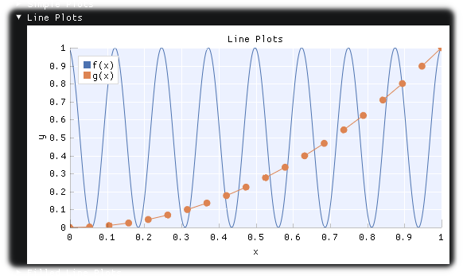  

   - [examples/FilledLinePlots.nim](examples/FilledLinePlots.nim)  
   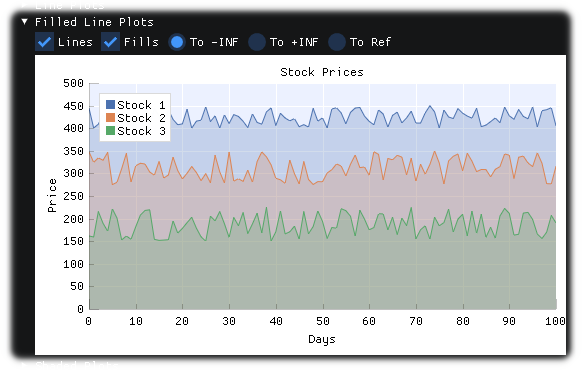  

   - [examples/ShadedPlots.nim](examples/ShadedPlots.nim)  
   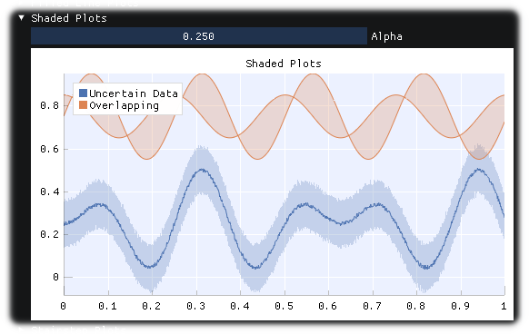  

   - [examples/ScatterPlots.nim](examples/ScatterPlots.nim)  
   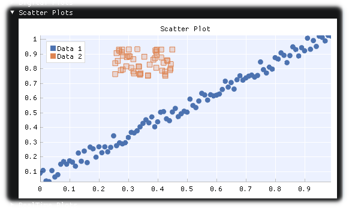  

   - [examples/RealtimePlots.nim](examples/RealtimePlots.nim)  ( It. dosn't work well.)  
     

   - [examples/StairstepPlots.nim](examples/StairstepPlots.nim)  
   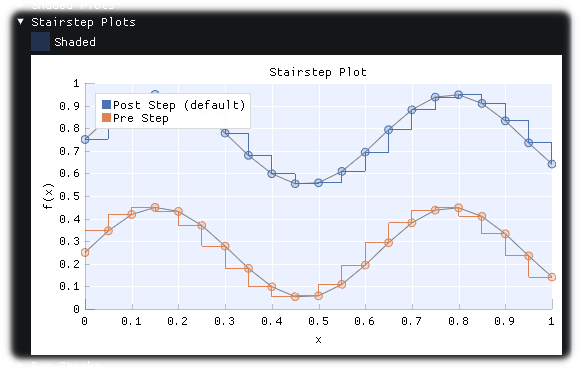  

   - [examples/BarGroups.nim](examples/BarGroups.nim)  
   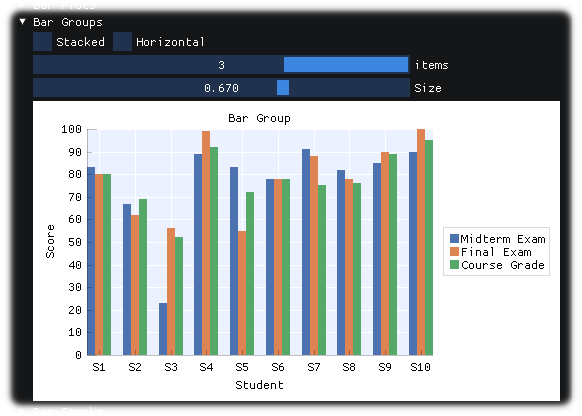  

   - [examples/BarPlots.nim](examples/BarPlots.nim)  
   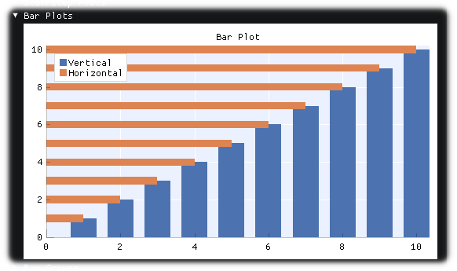  

   - [examples/BarStacks.nim](examples/BarStacks.nim)  
   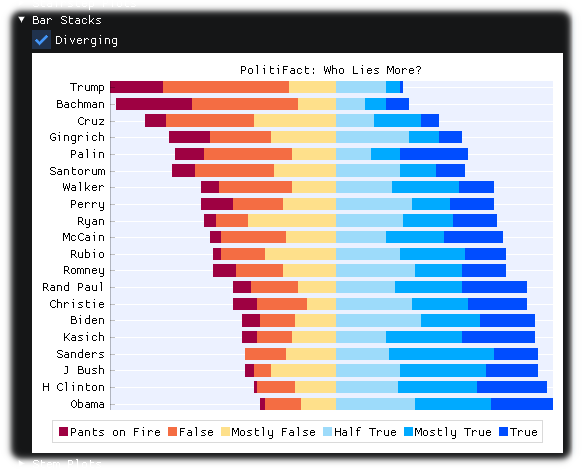  

   - [examples/ErrorBars.nim](examples/ErrorBars.nim)  
   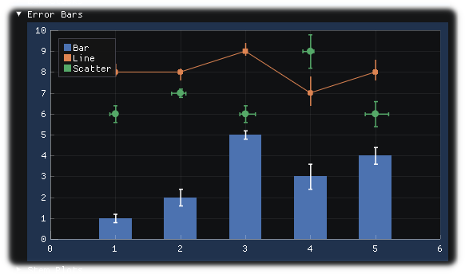  

   - [examples/StemPlots.nim](examples/StemPlots.nim)  
   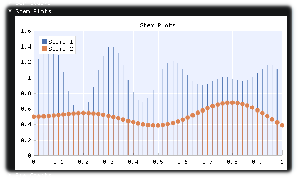  

   - [examples/InfiniteLines.nim](examples/InfiniteLines.nim)  
   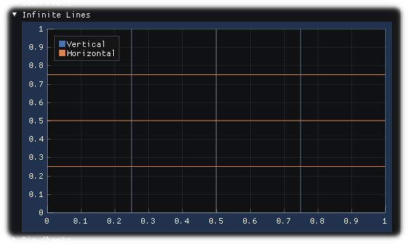  

   - [examples/PieCharts.nim](examples/PieCharts.nim)  
   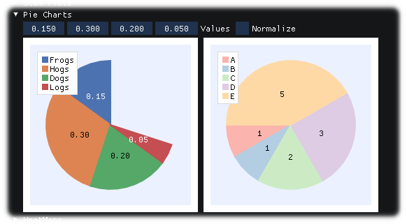  

   - [examples/HeatMaps.nim](examples/HeatMaps.nim)  
   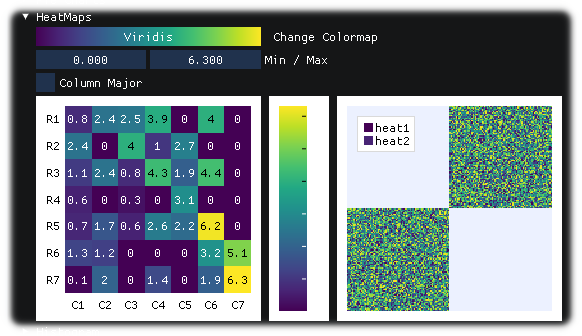  

   - [examples/HistoGram.nim](examples/HistoGram.nim)  
     

   - [examples/DigitalPlots.nim](examples/DigitalPlots.nim)  
   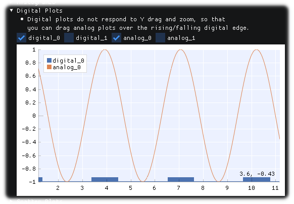  

   - [examples/Images.nim](examples/Images.nim)  
   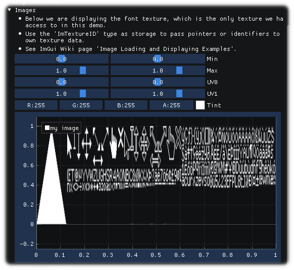  

   - [examples/MarkersAndText.nim](examples/MarkersAndText.nim)  ( It. dosn't work well.)  
   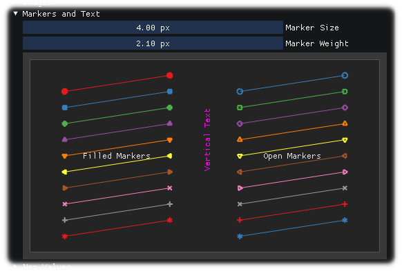  

   - [examples/NaNValues.nim](examples/NaNValues.nim)  
   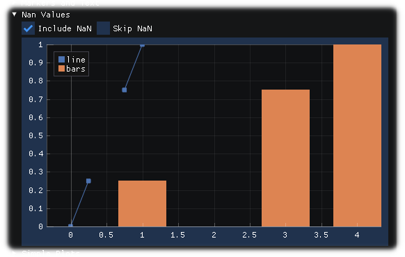  

#### Subplots

---

   - [examples/Tables.nim](examples/Tables.nim)  
   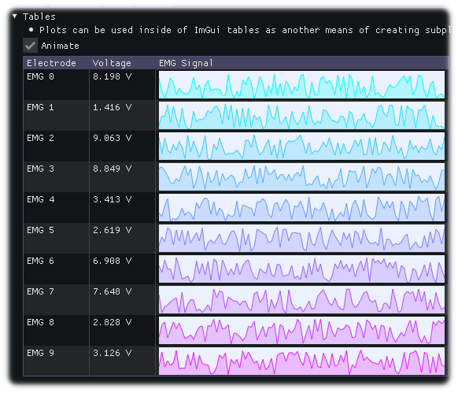  

#### Axes

---

   - [examples/LogScale.nim](examples/LogScale.nim)  
   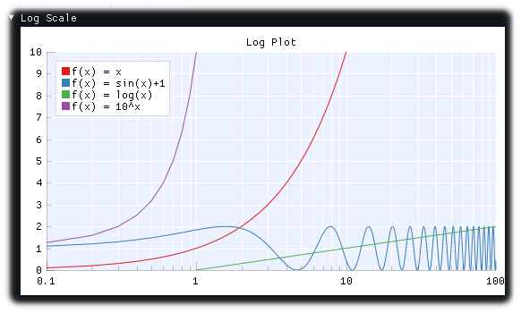  
