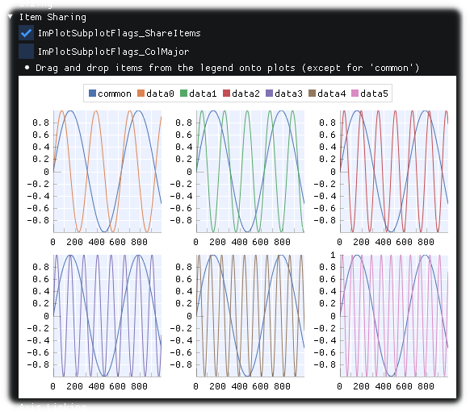
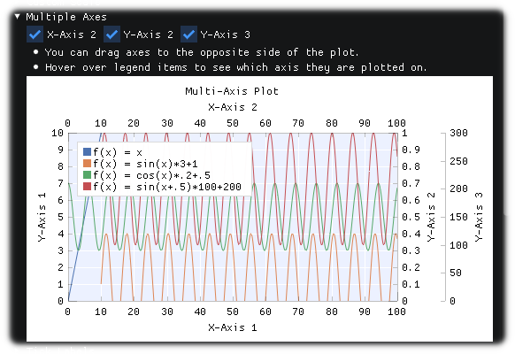
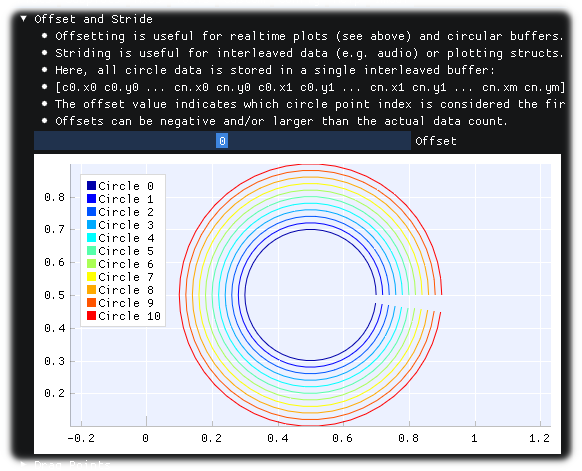
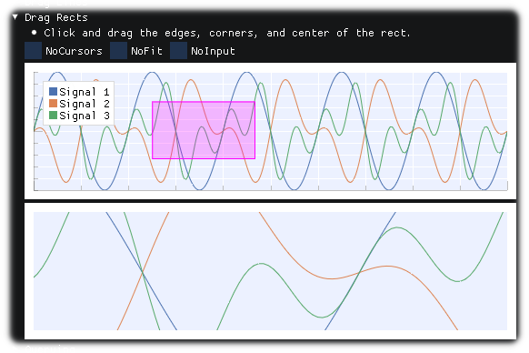
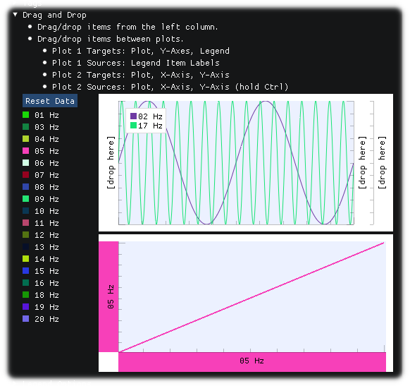
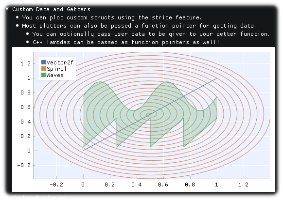

<!-- START doctoc generated TOC please keep comment here to allow auto update -->
<!-- DON'T EDIT THIS SECTION, INSTEAD RE-RUN doctoc TO UPDATE -->

- [Nim ImPlot binding](#nim-implot-binding)
- [Direct nimble install from Web](#direct-nimble-install-from-web)
- [Runing all demo programs](#runing-all-demo-programs)
- [Compiling application](#compiling-application)
- [Notice: Compilation options](#notice-compilation-options)
- [Generating ImPlot bindings for development](#generating-implot-bindings-for-development)
- [Development](#development)
- [Tools info](#tools-info)
- [Example gallery written in Nim language](#example-gallery-written-in-nim-language)
  - [Plots](#plots)
    - [LinePlots.nim](#lineplotsnim)
    - [FilledLinePlots.nim](#filledlineplotsnim)
    - [ShadedPlots.nim](#shadedplotsnim)
    - [ScatterPlots.nim](#scatterplotsnim)
    - [RealtimePlots.nim](#realtimeplotsnim)
    - [StairstepPlots.nim](#stairstepplotsnim)
    - [BarGroups.nim](#bargroupsnim)
    - [BarPlots.nim](#barplotsnim)
    - [BarStacks.nim](#barstacksnim)
    - [ErrorBars.nim](#errorbarsnim)
    - [StemPlots.nim](#stemplotsnim)
    - [InfiniteLines.nim](#infinitelinesnim)
    - [PieCharts.nim](#piechartsnim)
    - [HeatMaps.nim](#heatmapsnim)
    - [Histogram.nim](#histogramnim)
    - [DigitalPlots.nim](#digitalplotsnim)
    - [Images.nim](#imagesnim)
    - [MarkersAndText.nim](#markersandtextnim)
    - [NaNValues.nim](#nanvaluesnim)
  - [Subplots](#subplots)
    - [Tables.nim](#tablesnim)
    - [ItemSharing.nim](#itemsharingnim)
  - [Axes](#axes)
    - [LogScale.nim](#logscalenim)
    - [MultipleAxes.nim](#multipleaxesnim)
  - [Tools](#tools)
    - [OffsetAndStride.nim](#offsetandstridenim)
    - [DragRects.nim](#dragrectsnim)
    - [DragAndDrop.nim](#draganddropnim)
  - [Custom](#custom)
    - [CustomDataAndGetters.nim](#customdataandgettersnim)

<!-- END doctoc generated TOC please keep comment here to allow auto update -->


### Nim ImPlot binding

---

[ImPlot ](https://github.com/epezent/implot) is an immediate mode, GPU accelerated plotting library for [Dear ImGui](https://github.com/ocornut/imgui).

1. This project uses the modified generator that derived from the achievement of [Nimgl/imgui](https://github.com/nimgl/imgui) and [nimgl-imgui](https://github.com/daniel-j/nimgl-imgui)(forked).
1. This project also uses ImGui library ([nim-imgui (ImGui v1.89.9 latest)](https://github.com/dinau/nimgl-imgui)) derived from [Nimgl/imgui](https://github.com/nimgl/imgui) and [nimgl-imgui](https://github.com/daniel-j/nimgl-imgui)(forked).
1. Also have used [CImGui library](https://github.com/cimgui/cimgui)

### Direct nimble install from Web

---

```sh
nimble install https://github.com/dinau/nim_implot
```

### Runing all demo programs

---

```bash
git clone --recursive https://github.com/dinau/nim_implot
cd nim_implot
nimble test
```

Test source: [examples/demo](examples/demo)

### Compiling application

---

It has to be used **cpp** backend at compilation for example,

```sh
pwd
nim_implot
cd examples/demo
nim cpp -r ImPlotDemo.nim 
```

**Note**: **C** backend is not supported.

### Notice: Compilation options

---

If demo programs crash, please try to specify compilation option  
`--mm:refc` instead of `--mm:arc` or `--mm:orc`,  
especially if you use Nim-2.00, try to specify `--mm:refc`.  
These are TODO at this moment.

### Generating ImPlot bindings for development

---

```bash
pwd
nim_implot
nimble gen
```

Genarated file: [src/implot.nim](src/implot.nim)


### Development

---

It is currently being developed and tested on

* Windows 10
* (Debian 12 Bookworm)  

   ```sh
   $ sudo apt install xorg-dev libopengl-dev libgl1-mesa-dev
   ```

### Tools info

---
 
- Windows10
   - Nim Compiler Version 1.6.14 
   - gcc.exe (Rev2, Built by MSYS2 project) 13.2.0
- Debian 12 Bookworm 
   - Nim Compiler Version 1.6.14 
   - gcc (Debian 12.2.0-14) 12.2.0

### Example gallery written in Nim language

---

**Now all demo (over 50) programs have been implemented in Nim language** (2023/10),  
(Orignal demo program is here [implot_demo.cpp](https://github.com/epezent/implot/blob/master/implot_demo.cpp), (C++))  
below images are part of them.

#### Plots

---

##### [LinePlots.nim](examples/demo/tools/LinePlots.nim)  

  

##### [FilledLinePlots.nim](examples/demo/tools/FilledLinePlots.nim)  

  

##### [ShadedPlots.nim](examples/demo/tools/ShadedPlots.nim)  

  

##### [ScatterPlots.nim](examples/demo/tools/ScatterPlots.nim)  

  

##### [RealtimePlots.nim](examples/demo/tools/RealtimePlots.nim) 

  

##### [StairstepPlots.nim](examples/demo/tools/StairstepPlots.nim)  

  

##### [BarGroups.nim](examples/demo/tools/BarGroups.nim)  

  

##### [BarPlots.nim](examples/demo/tools/BarPlots.nim)  

  

##### [BarStacks.nim](examples/demo/tools/BarStacks.nim)  

  

##### [ErrorBars.nim](examples/demo/tools/ErrorBars.nim)  

  

##### [StemPlots.nim](examples/demo/tools/StemPlots.nim)  

  

##### [InfiniteLines.nim](examples/demo/tools/InfiniteLines.nim)  

  

##### [PieCharts.nim](examples/demo/tools/PieCharts.nim)  

  

##### [HeatMaps.nim](examples/demo/tools/HeatMaps.nim)  

  

##### [Histogram.nim](examples/demo/tools/Histogram.nim)  

  

##### [DigitalPlots.nim](examples/demo/tools/DigitalPlots.nim)  

  

##### [Images.nim](examples/demo/tools/Images.nim)  

  

##### [MarkersAndText.nim](examples/demo/tools/MarkersAndText.nim)  

  

##### [NaNValues.nim](examples/demo/tools/NaNValues.nim)  

  

#### Subplots

---

##### [Tables.nim](examples/SubPlots/demo/Tables.nim)  

  

##### [ItemSharing.nim](examples/demo/SubPlots/ItemSharing.nim)  

  

#### Axes

---

##### [LogScale.nim](examples/demo/Axes/LogScale.nim)  

  

##### [MultipleAxes.nim](examples/demo/Axes/MultipleAxes.nim)  

  

#### Tools

---

##### [OffsetAndStride.nim](examples/demo/Tools/OffsetAndStride.nim)  

  

##### [DragRects.nim](examples/demo/Tools/DragRects.nim)  

  

##### [DragAndDrop.nim](examples/demo/Tools/DragAndDrop.nim)  

  

#### Custom

---

##### [CustomDataAndGetters.nim](examples/demo/Tools/CustomDataAndGetters.nim)  

  
